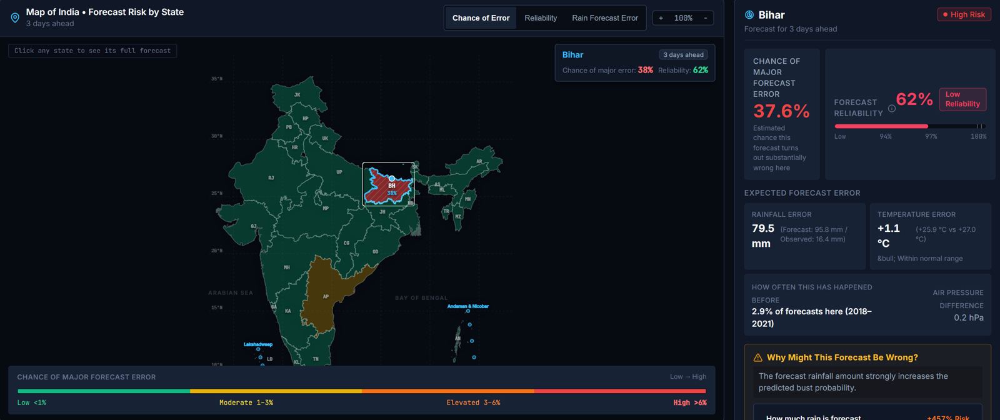

# AI-Based Forecast Bust Detection for Medium-Range Weather Forecasts

**Smart India Hackathon 2026 · Problem Statement 26079 · Team TWP**

> Don't just ask what the weather forecast says. Ask where the forecast should be trusted.

We are **not** building another weather model. This is a **forecast reliability layer** that sits on
top of an existing NWP forecast and estimates, for each Indian state/UT and each lead day (Day 1-10):

- the **chance of a major forecast error** ("bust"), from LightGBM models for rain and temperature,
- **why** the forecast is flagged (SHAP feature contributions turned into plain-English reasons),
- **similar past forecasts** and what actually happened then (analog search over 1.79 M past cases),
- the historical error context for that state and lead day.



*Real screenshot of the prototype running on archived ECMWF HRES data from the 2021 hold-out year.
Bihar, forecast issued 30 Sep 2021 12Z, Day 3: the forecast said 95.8 mm, ERA5 recorded 16.4 mm (a
heavy-rain false alarm). The model rated it 37.6 %, the highest in India for that run.*

### Results (held-out historical evaluation)

Trained on monsoon (JJAS) 2018-2020, tested on the **unseen 2021** season (446,520 forecast cases).

| Target | ROC-AUC [95% CI] | Brier Skill Score [95% CI] | PR-AUC (base rate) |
|---|---|---|---|
| Rain bust (≥ 2 IMD rainfall categories off, or heavy rain missed / falsely forecast) | **0.913** [0.909, 0.917] | 0.31 [0.295, 0.322] | 0.46 (0.023) |
| Temperature bust (2 m error > 3 °C) | **0.825** [0.818, 0.831] | 0.10 [0.099, 0.115] | 0.25 (0.072) |

Intervals: block bootstrap over the 244 forecast issuances (`src/verification/bootstrap_ci.py`).

**Against the standard baseline.** On the identical 446,520 rows, raw 50-member IFS ensemble rain
spread scores ROC-AUC 0.847; the model is **+0.065 higher [0.059, 0.072]**, and the gap grows with
lead time (+0.006 at Day 1, +0.113 at Day 10). Combining the two adds nothing measurable (+0.001,
interval includes 0). Tested on 2021 only (`src/verification/ensemble_vs_model.py`).

- Rain ROC-AUC falls from 0.97 at Day 1 to 0.87 at Day 10, and is ≥ 0.80 in 28 of 29 states.
- Stable across different train/test years (rain ROC-AUC 0.908 / 0.907 / 0.913).
- The forecast's own values carry most of the signal (ablation: 0.69 → 0.92 when they are added).
- Leakage control: future observations are never model inputs; thresholds and historical statistics
  are fit on training years only.

Full numbers: `models/registry/*.json`, `outputs/phase3/`. API contract: `docs/api_contract.md`.

### Honest status

This is a research prototype validated on **historical** ECMWF HRES forecasts (via WeatherBench2)
with ERA5 reanalysis as truth. It does **not** ingest live forecasts; operational use needs an
authorized live NWP feed. It is not affiliated with or deployed by any agency.

### Run the prototype

```bash
# backend (FastAPI, port 8000) - the first start warms the analog index (~2 min)
.venv\Scripts\python -m uvicorn src.production.api:app --port 8000
# frontend (React + Vite, port 3000, proxies /api to the backend)
npm --prefix frontend install
npm --prefix frontend run dev
```

The trained models (`models/artifacts/`, `models/registry/`) are committed. The 298 MB analog
reference set (`models/phase5/reference.parquet`) is gitignored: rebuild it with the Phase 0-3
pipeline below, then `python -m src.phase5.build_analog_index`.

### Build history

| Phase | What it added |
|---|---|
| 0 | Data pipeline: ECMWF HRES + ERA5 from WeatherBench2, 2018-2021 error database (20.5 M rows) |
| 1 | Forecast error atlas, baselines, chronological evaluation |
| 2 | First LightGBM bust model, bust-definition audit, 29-state geography, leakage audit |
| 3 | Ablation, robustness (year / lead day / state), calibration, ensemble pilot |
| 4 | Production inference engine + FastAPI service |
| 5 | Historical analog search ("similar past forecasts") |
| 6 | React dashboard + `/api/v1` frontend adapter |

The sections below are the original phase-by-phase notes.

## A note on the Kaggle dataset

If you found this project via the `daily-rainfall-at-state-level.csv` Kaggle
file: that file does **not** contain a forecast. Its `rfs` column is
mislabeled on Kaggle as "rainfall forecast" - the original source
([India Data Portal / India-WRIS](https://ckandev.indiadataportal.com/dataset/climate-data/resource/5bddf229-7ce5-4c5b-895b-411f801f26e9))
labels it **"Rainfall Storage"**, a water-resources volume metric, not a
forecast. (`rfs / actual` is a near-constant ratio that tracks state area,
e.g. Rajasthan ~11.7x, Delhi ~0.05x - a real forecast wouldn't behave like
that.) It's still fine as state-level actual/normal/deviation context, but
verification needs a real forecast.

## What we actually use instead

| Role | Source | Notes |
|---|---|---|
| Forecast | **ECMWF HRES** via [WeatherBench2](https://weatherbench2.readthedocs.io/) (public GCS bucket) | Deterministic, 2016-2022, init 00Z/12Z, lead 0-240h every 6h |
| Truth | **ERA5 reanalysis**, same WeatherBench2 bucket | Same 1.5-degree grid as HRES - no regridding needed |
| Later | **NCMRWF's own NCUM/NEPS** output | Ask via the SIH SPOC/Q&A - swap straight into this same pipeline |
| Later | **IMD gridded rainfall** (0.25-deg) | Better rainfall truth than ERA5 once available |

Both stores were verified directly against the public bucket (paths, variable
names, units, chunking) before writing any code - see `src/config.py` for the
exact zarr paths.

## Project layout

```
src/
  config.py          data sources, India bbox, variable list, bust-definition constants
  regions.py         coarse India regions as lat/lon boxes (swap for a real shapefile later)
  fetch_data.py       pulls forecast + truth from WeatherBench2, crops to India, caches locally
  build_error_db.py   aligns forecast vs truth, computes error per grid cell/lead day/region
  label_busts.py       flags busts: percentile rule + IMD rainfall-category rule + temp threshold
  summarize.py          collapses bust_labels.parquet into a small, git-friendly CSV summary
run_phase0.py          one-command pipeline: fetch -> error db -> bust labels -> summary
data/
  raw/                 cached NetCDFs from fetch_data.py (gitignored - regenerate, don't commit)
  processed/
    error_db.parquet, bust_labels.parquet   full row-level detail (gitignored once the date
                                              range is wide enough to exceed GitHub's 100MB/file
                                              limit - regenerate locally via run_phase0.py)
    summary_by_region_lead_season.csv        small aggregate, safe to commit - what's actually
                                              tracked in this repo
```

## Running it

```bash
python -m venv .venv
# Windows:
.venv\Scripts\pip install -r requirements.txt
.venv\Scripts\python run_phase0.py --start 2018-06-01 --end 2018-09-30
```

Default window is JJAS 2018 (captures the Aug-2018 Kerala floods bust). First
run downloads and caches the India subset from GCS (a few GB depending on the
date range); re-runs reuse the cache unless you pass `--force`.

Output: `data/processed/bust_labels.parquet` - one row per
(init_time, lead_day, grid cell), with forecast value, observed value, error,
region, and bust flags (`bust_precip`, `bust_temp`, `bust_any`), plus a crude
`forecast_confidence` score. This file is gitignored once it gets large (see
below) - `data/processed/summary_by_region_lead_season.csv` (bust rate and
mean |error| per region/lead_day/season) is the small, committed view of it.

### Scaling up

- For more than ~1 season, fetch year-by-year instead of one continuous
  range - a transient network blip then only costs the year in progress:
  ```bash
  ./fetch_multi_year.sh 2018 2021
  ```
  (this is how the 2018-2021 data in this repo's summary was built - 4 years,
  20.5M rows, ~830MB of full row-level detail kept local-only, see below)
- Widen `--start`/`--end` on a single `run_phase0.py` call for a smaller custom range.
- Add more variables in `src/config.py` (`VARIABLES`) - e.g. geopotential
  height at 500hPa for large-scale pattern skill, wind fields for cyclones.
- Move to the full 0.25-degree WB2 stores for higher spatial detail (ideally
  from a machine in the same GCP region as the bucket, to avoid slow/costly
  egress on the full-res chunks).
- Swap in ensemble forecasts (`ifs_ens` store) to get spread-based confidence,
  not just single-forecast error.

## Phase 1 - forecast error atlas + baselines

`src/phase1/` turns the Phase-0 error database into a rigorous baseline and
analysis system, over an explicit **JJAS 2018-2021** window (no re-fetching -
it reuses `data/processed/error_db.parquet`, already built from the full
2018-2021 calendar years):

```
src/phase1/
  dataset.py          JJAS 2018-2021 filter + chronological train(2018-2020)/test(2021)
                        split + bust labels with percentile thresholds fit on TRAIN ONLY
                        (a leakage fix over Phase 0's label_busts.py - see its docstring)
  dataset_summary.py    outputs/phase1/dataset_summary.{json,md}
  error_atlas.py         error_by_lead/region/month/region_lead.csv, bust_rate_by_lead.csv,
                        bust_label_composition_by_region.csv
  plots.py                5 PNGs under outputs/phase1/plots/
  baselines.py             Baseline A (region x lead x month climatology), B (lead-only);
                        C (ensemble spread) is documented as unavailable, not fabricated -
                        HRES is a single deterministic run, no ensemble members to derive spread from
  evaluate.py                ROC-AUC, PR-AUC, Brier, Brier Skill Score, precision/recall/F1,
                        false-alarm rate, miss rate, reliability diagram - on the 2021 holdout
  manifest.py                outputs/phase1/experiment_manifest.json (full reproducibility record)
run_phase1.py            one-command pipeline: summary -> atlas -> plots -> baselines -> manifest
tests/                    first automated test suite (12 tests) - region assignment, IMD bins,
                        JJAS window boundaries, and a dedicated leakage check that a
                        train-only threshold is unaffected by test-only outliers
```

```bash
.venv\Scripts\python -m pytest tests/ -v
.venv\Scripts\python run_phase1.py
```

**Key finding so far:** simple region/lead/month climatology barely beats a
flat base-rate reference (ROC-AUC ~0.51-0.52, Brier Skill Score ~0). Traced
to the bust label itself: 3 of its 5 component rules are percentile
thresholds *fit per (region, lead_day)*, so they occur at a near-constant
~9% rate everywhere by construction - which caps how much region/lead
climatology can ever predict. The two fixed-threshold rules (IMD category
miss, temp hard threshold) *do* carry real regional signal but are a
minority of overall bust occurrences (see
`outputs/phase1/bust_label_composition_by_region.csv`). This is expected at
this stage - Phase 1's job is to establish that honestly, not to be
predictive yet.

## Next steps

The original roadmap (LightGBM, analog search, SHAP explanations, calibration,
API + dashboard) is implemented - see the build history at the top. Still open:

1. **Live input**: connect an authorized live NWP feed (e.g. NCMRWF NCUM/NEPS)
   and retrain on that model's own error history.
2. **Better truth and resolution**: IMD 0.25° gridded rainfall as truth, 0.25°
   forecast fields, and current state boundaries (the boundary file predates
   the Telangana and Ladakh splits).
3. **Ensemble spread**: promote the ensemble features from the Phase 3 pilot
   once they can be computed at full scale.
4. **Case replays**: recent high-impact events (e.g. Biparjoy 2023, Wayanad
   2024) need forecast data beyond the 2016-2022 WeatherBench2 HRES archive.
